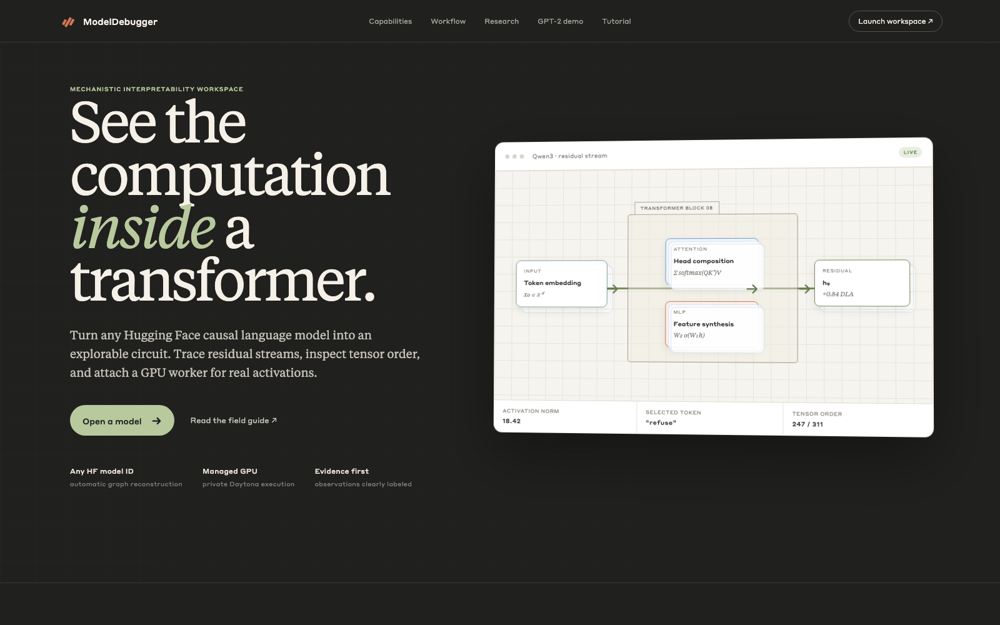
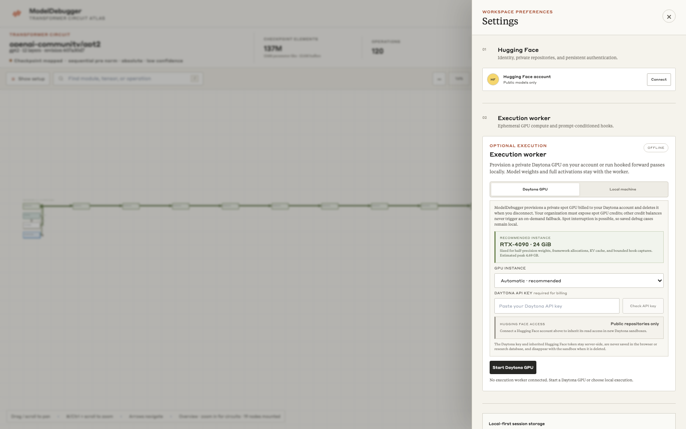
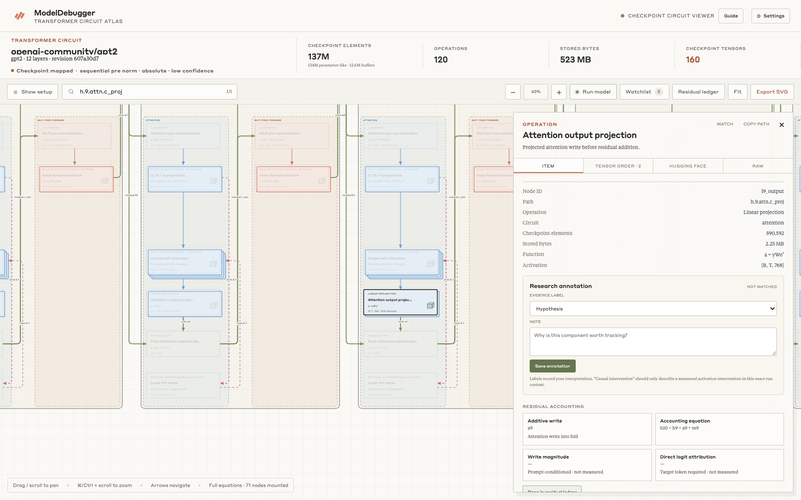
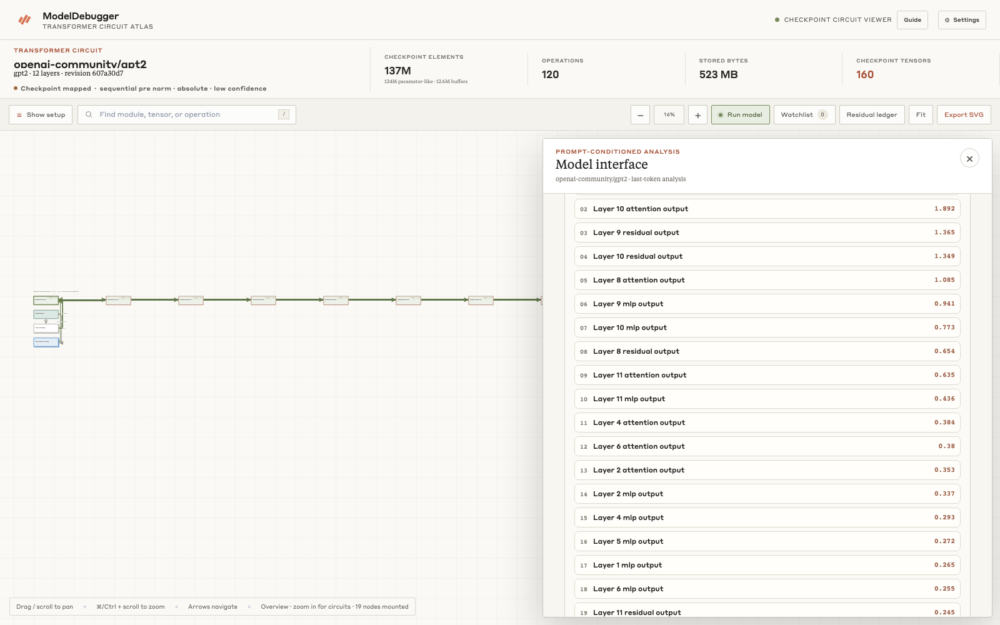
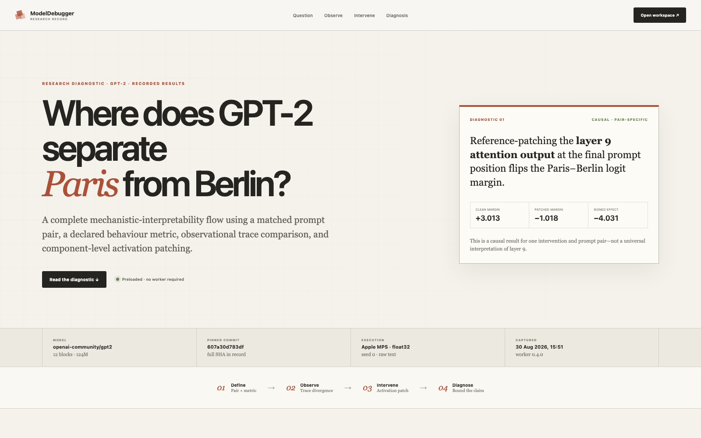
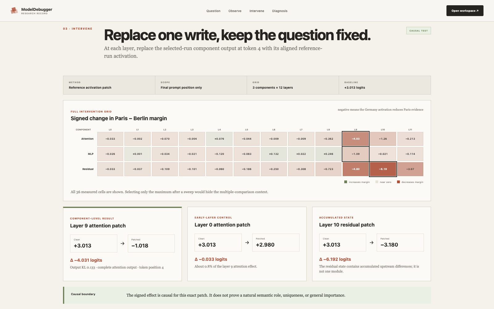

# ModelDebugger

> **From checkpoint map to causal evidence.**

ModelDebugger turns a compatible Hugging Face causal language model into an interactive circuit atlas and a reproducible mechanistic-interpretability workspace. Inspect structure without executing remote model code, attach private compute only when an experiment needs weights, and carry a hypothesis from paired traces through intervention and verification.

<p align="center">
  <a href="#run"><strong>Run locally</strong></a> ·
  <a href="#how-daytona-is-used">Daytona execution</a> ·
  <a href="#product-tour">Product tour</a> ·
  <a href="MISSION.md">Research standard</a>
</p>



## What makes it different

| Architecture-neutral inspection | Evidence discipline | Private, portable execution |
|---|---|---|
| Resolves the strongest safe checkpoint representation available—exact Safetensors map, indexed manifest, or explicitly limited configuration scaffold—without unpickling remote weights. | Keeps structural, observational, and causal claims separate. Unmeasured values stay unmeasured, failed interventions stay negative, and unsupported methods are omitted. | Runs the same authenticated worker on a local machine or a private Daytona spot GPU. Weights and full activations stay beside the worker; cases and compact results remain local. |

## How Daytona is used

Daytona is the optional managed execution path, not a requirement for exploring ModelDebugger. Checkpoint reconstruction, saved cases, the field guide, and the preloaded GPT-2 diagnostic work without it; the included diagnostic was recorded on a local Apple Metal worker.

| 01 · Validate | 02 · Execute | 03 · Remove |
|---|---|---|
| **Check API key** makes one bounded, read-only request and consumes no GPU credits. | ModelDebugger creates a private **spot-only GPU** sandbox in the user's organization and installs the same worker used locally. | Disconnecting deletes the sandbox immediately, with a two-hour deletion backstop for interrupted sessions. |



The Daytona key remains in loopback-server memory and is never written to browser storage, the research database, or the sandbox. A connected Hugging Face read token is inherited server-side without exposure to browser JavaScript. Fixed analysis routes return compact measurements and explicitly bounded activation slices; model weights and full activation tensors remain in the sandbox. Daytona usage is billed to the user's account and requires spot GPU credits in the selected organization.

## Product tour

### Inspect a checkpoint as a circuit

Search, pan, and zoom through a provenance-aware graph; select any tensor-backed operation to inspect shape, dtype, source path, residual role, and downstream routing. Stacked cards stay within their layout lane and obstacle-aware edges route cleanly around nodes.



### Compare matched prompts before making a causal claim

Aligned traces rank where two behaviours diverge across residual state, cosine distance, target-token attribution, attention, component contribution, and cache state. These are candidate-generating observations—not proof of causality.



### Follow a complete diagnostic, not a cherry-picked chart

The dedicated GPT-2 research record preserves its prompts, metric, provenance, intervention sweep, measured result, and claim boundary on one shareable route. The headline updates only when the recorded evidence supports it.



### Keep the intervention surface visible

The full 12-layer × 3-component activation-patching grid remains inspectable alongside the strongest effect, region summary, and interpretation—36 recorded cells rather than a single favourable example.



All images above are fresh captures from the running web application; no interface mock-ups are used.

## What it does

The app accepts a Hugging Face repository ID and optional revision rather than hand-authored model JSON. It inventories the repository and reads `config.json` plus the strongest checkpoint metadata that is safe to inspect. Exact maps preserve tensor names, dtypes, shapes, offsets, sizes, ranks, and shard order; weaker resolver tiers label unavailable facts instead of inventing them.

Once a worker loads the checkpoint, **Run model** records prompt tokens, next-token probabilities, target rank, output entropy, KV-cache and device memory, residual norms, target-token direct logit attribution, component writes, attention-head entropy, and hook coverage. A synchronized inference waterfall separates request preparation, tokenization, input staging, hook setup, instrumented forward, scoring, activation analysis, optional logit-lens work, result assembly, and retention. Worker time is reported separately from browser-observed round-trip latency.

The debugging workbench persists complete research cases in local SQLite: pinned model and revision, benchmark examples, prompts, expected behaviour, tokenizer and chat-template context, metric, seed, generation settings, paired traces, interventions, candidate circuit, verification, and notes. Cases survive refreshes and server restarts and export as a portable Markdown report with evidence tables, a Mermaid circuit, machine-readable JSON, and caveats.

The model-aware workflow includes six behaviour metrics; zero, mean, resample, patch, scale, and steering interventions; signed causal effects; EAP candidate discovery followed by intervention-backed ACDC pruning; a block/head/token/feature microscope; numerical, hook, cache, latency, and memory diagnostics; benchmark exploration; and guardrail verification. Every runtime view is capability-gated for the loaded architecture, so a method that cannot run is absent rather than presented as a dead control.

Circuit discovery is an architecture-neutral residual-write adaptation inspired by Conmy et al.'s [Towards Automated Circuit Discovery for Mechanistic Interpretability](https://arxiv.org/abs/2304.14997) and Syed, Rager, and Conmy's [Attribution Patching Outperforms Automated Circuit Discovery](https://arxiv.org/abs/2310.10348). It uses EAP for first-order candidate ranking, then evaluates actual control-activation patches in an ACDC-style greedy pass. The UI reports the adaptation's bounded scope, fidelity, stability, and limitations instead of presenting it as a reproduction of every TransformerLens edge type.

Product purpose, evidence standards, design principles, and the inheritance contract for future components live in [`MISSION.md`](MISSION.md). The circuit presentation is visually inspired by [Transformer Circuits](https://transformer-circuits.pub/) and its mathematical treatment of residual-stream computation.

## Run

```bash
npm run dev
```

The first run creates an isolated `.modeldebugger-app` environment, installs the pinned Daytona SDK, and starts the Python server at <http://localhost:4173>.

Open <http://localhost:4173/demo/gpt2-capital-diagnostic> for a worker-free, preloaded research record captured from a real GPT-2 run. It follows one matched France/Germany prompt pair from a declared Paris−Berlin logit metric through observational divergence and a 36-cell activation-patching sweep, then states the supported diagnostic and its claim boundary.

For repeatable UX work, use **Open GPT-2 example** below the checkpoint importer. It loads the real `openai-community/gpt2` graph through the normal Hugging Face route and opens a six-example benchmark fixture. Initial row outcomes and scores are explicitly illustrative; running the benchmark with a worker replaces them with observed GPT-2 measurements. The repository and revision fields remain editable for the ordinary any-model workflow.

Use the in-app **Connect** control with a Hugging Face read or fine-grained token to inspect private and gated repositories your account can access. After validation, the token remains only in the loopback server's memory. The browser receives opaque 30-day session identifiers in HttpOnly, SameSite cookies: one is scoped to Hugging Face routes and one only to Daytona provisioning so a new sandbox can inherit the same validated access without exposing the key to page JavaScript or browser-readable storage. Restarting the server invalidates those browser sessions. Authenticated model responses never enter the shared public-model cache, and **Disconnect** clears both cookie references and the in-memory token. `HF_TOKEN` remains available as an optional server-level credential. Set `PORT` to override the default port.

## Managed Daytona execution

Daytona is the default GPU path. Open **Settings → Execution worker**, paste the Daytona API key for the account that should be billed, and use **Check API key** for a read-only credential check that never creates a sandbox or spends GPU credits. Then review the model-aware GPU recommendation and choose **Start Daytona GPU**. For private or gated Hugging Face repositories, connect your Hugging Face account once; every new Daytona sandbox automatically inherits that validated read token server-side.

The Daytona key is submitted from the masked settings field directly to the loopback backend and retained only in memory; it is never placed in browser storage, the SQLite research database, or the sandbox. An inherited Hugging Face token is injected directly from the validated server session into the private sandbox environment and is never returned to browser code. The backend creates a private spot GPU sandbox—on-demand capacity is never requested—authenticates Daytona's preview gateway and the worker independently, and proxies only fixed execution routes. The Daytona organization must expose spot GPU credits; a different wallet balance does not authorize ModelDebugger to retry with on-demand capacity. Spot capacity can be interrupted, so research cases remain stored locally. Model weights and full activation tensors remain in Daytona; the app receives compact summaries and bounded activation slices. Disconnect deletes the sandbox and its inherited credential immediately, with a two-hour automatic-deletion backstop to protect limited credits if the local process exits unexpectedly.

The recommendation estimates half-precision weight storage plus framework, KV-cache, and hook-capture headroom. If half precision will not fit on one supported GPU, it recommends 4-bit NF4 loading with BF16 compute. This is a conservative preflight estimate rather than a guarantee for every custom architecture or prompt length. Selecting a smaller override than the estimate is rejected before credits are used.

## Local hooked execution

Choose **Settings → Execution worker → Local machine**, then start a worker in a second terminal:

```bash
make -C '/Users/maximiliannicholson/Documents/untitled folder 5' worker
```

The first run creates `.modeldebugger-worker`, installs PyTorch and the Hugging Face model dependencies, and starts the prefilled `http://127.0.0.1:8765` endpoint. The worker writes its random secret to a user-only `.modeldebugger/local-worker.json` session file, so the loopback backend discovers it automatically without making you copy credentials. The worker selects CUDA or Apple Metal when available and otherwise runs on CPU. It reads private-model credentials from the normal Hugging Face cache or `HF_TOKEN` in the worker process environment.

## Verify

```bash
npm test
```

This compiles the Python package, checks browser graph routing, and runs graph-contract, Safetensors, live HTTPS/Hugging Face, cookie-session, cache, and HTTP-server tests. Validate the Python sources without running tests with:

```bash
npm run build
```

## Prerequisites

- Python 3.11 or newer
- Node.js for the browser routing test

The backend uses Python's standard library for checkpoint inspection and the pinned Daytona Python SDK for managed GPU lifecycle operations. No compiler, libcurl, or cJSON installation is required.

## Backend

The Python backend serves the frontend and exposes:

- `GET /api/health`
- `GET /api/huggingface/account` with a Hugging Face Bearer token or saved session cookie
- `POST /api/huggingface/logout`
- `GET /api/huggingface?model=<repository>&revision=<revision>`
- `GET /api/debug/cases` and `GET /api/debug/cases/<id>`
- `POST /api/debug/cases`, `PUT /api/debug/cases/<id>`, and `DELETE /api/debug/cases/<id>`
- `GET /api/huggingface/dataset?dataset=<repository>` (first 100 rows through the official dataset viewer)
- `GET /api/runtime/status`
- `POST /api/runtime/daytona/recommend`
- `POST /api/runtime/daytona/validate`
- `POST /api/runtime/daytona/provision`
- `POST /api/runtime/connect`
- `POST /api/runtime/disconnect`
- `POST /api/runtime/load`
- `POST /api/runtime/forward`
- `POST /api/runtime/compare`
- `POST /api/runtime/intervene`
- `POST /api/runtime/root-cause`
- `POST /api/runtime/verify`
- `POST /api/runtime/activation`

Hugging Face files are inspected with bounded metadata requests and Safetensors byte ranges when that format is present. The endpoint returns one authoritative `graph` record with a resolver tier: checkpoint mapped, manifest mapped, or configuration scaffold. Exact maps retain raw headers, dtypes, shapes, offsets, sizes, ranks, shard order, and file metadata. Manifest maps retain tensor names and shard membership while leaving shapes, dtypes, offsets, element counts, and parameter totals unavailable. Configuration scaffolds retain only supported configuration and repository facts. Safetensors does not encode `requires_grad`, so even exact maps distinguish recognized buffers from parameter-like storage instead of claiming a trainable-parameter count. Internal validation checks only facts available at the selected tier and never upgrades a scaffold into an exact checkpoint map.

Only browser-native work remains in JavaScript: DOM/SVG creation, obstacle-aware graph routing, viewport virtualization, pan/zoom, keyboard and pointer interaction, accessibility state, forms, loading transitions, token handling, and locale-aware display formatting.

### Project layout

- `refusalscope/__main__.py` — `python -m refusalscope` launcher.
- `refusalscope/server.py` — threaded loopback HTTP server, routing, validation, static serving, auth, sessions, and public response cache.
- `refusalscope/debug_store.py` — thread-safe SQLite persistence for reproducible debugging cases.
- `refusalscope/huggingface.py` — Hub inventory, checkpoint-format resolution, safe artifact policy, Safetensors range parsing, PyTorch manifest mapping, and account sanitization.
- `refusalscope/graph.py` — decoder discovery, architecture evidence, tensor mapping, graph topology, statistics, layout, fallback edge geometry, search records, circuit classes, and inspector projections.
- `refusalscope/http_client.py` — authenticated standard-library HTTPS transport and response capture.
- `refusalscope/config.py` — inspection and request limits.
- `tests/` — unit, graph-contract, live HTTPS/Hub, cookie-session, cache, and server integration tests.
- `src/app.js` — browser rendering and interaction.
- `src/graph-routing.js` — obstacle-aware browser edge routing.
- `src/presentation.js` — locale-aware display formatting that must run in the browser.
- `refusalscope/daytona.py` — model-aware GPU sizing plus private Daytona provisioning and teardown.
- `workers/modeldebugger_worker.py` — authenticated local or managed model and activation worker.
