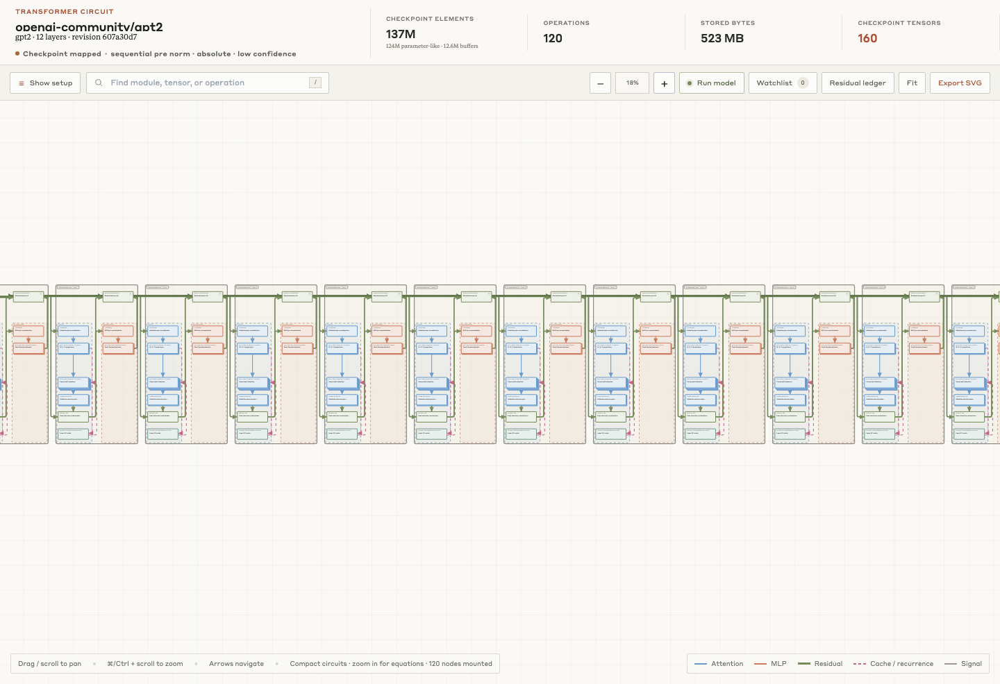
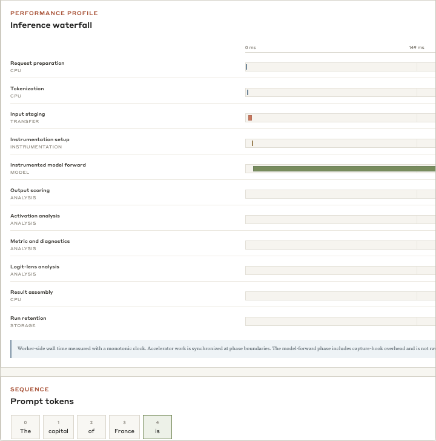
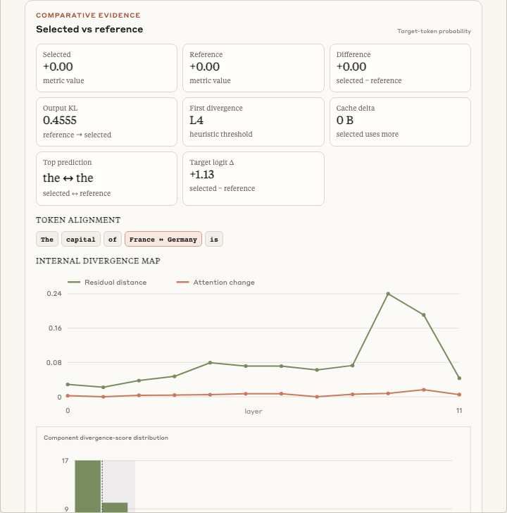
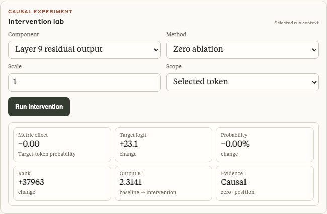
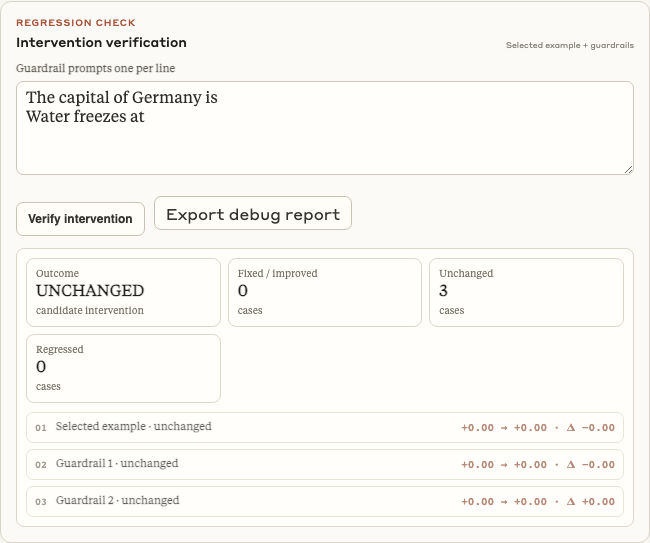

# ModelDebugger

ModelDebugger is a local mechanistic-interpretability interface for Hugging Face causal language-model checkpoints. Its only input is a Hugging Face repository ID and optional revision; it does not accept hand-authored model JSON.

## How Daytona is used

Daytona is ModelDebugger's optional managed execution-worker path. Checkpoint metadata inspection, circuit reconstruction, saved research cases, the tutorial, and the preloaded GPT-2 diagnostic do not require Daytona. The recorded GPT-2 diagnostic in this repository was captured with the local worker on Apple Metal, not on Daytona.

When a user selects **Settings → Execution worker → Daytona GPU**, ModelDebugger validates the supplied Daytona API key with one bounded, read-only request. Starting execution then creates a private **spot GPU** sandbox in the user's Daytona organization, installs the same authenticated worker used for local execution, and proxies only the fixed model-loading and analysis routes through the loopback backend. On-demand Daytona capacity is never requested.

The Daytona API key remains in server memory and is never stored in browser storage, the research database, or the sandbox. If the user has connected Hugging Face, its validated read token is inherited server-side by the new private sandbox without being exposed to browser JavaScript. Model weights and full activation tensors remain beside the worker; the webapp receives compact measurements and explicitly bounded activation slices. Disconnecting deletes the sandbox immediately, with a two-hour automatic-deletion backstop for interrupted local sessions. Daytona usage is billed to the user's account and requires spot GPU credits in the selected organization.

Product purpose, evidence standards, design principles, and the inheritance contract for future components are defined in [`MISSION.md`](MISSION.md).

The circuit diagram and research-paper interface are visually inspired by [Transformer Circuits](https://transformer-circuits.pub/) and its mathematical treatment of residual-stream computation. The interface loads the source site's Styrene A and Tiempos Text webfonts directly from its published CDN, with system fallbacks.

The app inventories the repository and reads `config.json` plus the strongest checkpoint metadata that is safe to inspect without executing remote content. Safetensors headers produce an exact tensor map; PyTorch index JSON produces a name-and-shard manifest; monolithic PyTorch, GGUF, adapter-only, and configuration-only repositories produce an explicitly limited configuration scaffold. The Python backend never unpickles remote weights merely to draw a graph, and the browser labels the selected resolver tier and every unavailable exact fact.

The graph also exposes a residual-stream ledger. It accounts for the embedding, attention write, MLP write, and accumulated residual state at every decoder block, links each row back to the corresponding graph node, and reserves signed activation-norm and direct-logit-attribution fields for prompt-conditioned traces. Because checkpoint metadata does not contain activations, those run-dependent values are explicitly shown as unmeasured instead of being estimated or fabricated.

After an execution worker loads the open checkpoint, **Run model** becomes a prompt-conditioned model interface. A hooked pass displays prompt tokens, next-token probabilities, target rank, output entropy, KV-cache size, device memory, residual norms, target-token DLA, residual-update norms, convergence to the final residual state, attention/MLP write traces, an attention-head entropy map, and the hook inventory. A synchronized inference waterfall separates request preparation, tokenization, input staging, hook setup, the instrumented model forward, output scoring, activation analysis, metrics, optional logit-lens work, result assembly, and run retention. It reports worker time separately from the browser-observed round trip and labels hook-enabled latency as distinct from raw serving latency. The same measurements are projected back onto graph nodes and component edges, so charts and circuit topology remain linked. Views that fail runtime capability checks for the loaded model are omitted rather than left as dead controls.

The debugging workbench persists complete research cases in local SQLite storage. A case records the pinned model/revision, benchmark examples, selected/reference prompts, expected behaviour, tokenizer and chat-template context, metric, seed, dtype/device, generation settings, notes, paired traces, interventions, candidate circuit, and verification results. Saved cases can be reopened after a refresh or server restart from the **Debug cases** library.

The connected workflow includes six behaviour metrics; aligned selected/reference traces; ranked residual, cosine, logit-lens, attention, contribution, and cache divergence; zero/mean/resample/patch/scale/steering interventions; signed causal effects; EAP candidate discovery followed by intervention-backed ACDC pruning; a block/head/token/feature microscope; numerical, hook, cache, latency, and memory diagnostics; JSONL/CSV/Hugging Face benchmark exploration across any outcome; guardrail verification; and a portable Markdown report with settings, evidence tables, a Mermaid circuit graph, results, machine-readable JSON, and caveats.

Circuit discovery is an architecture-neutral, residual-write adaptation inspired by Conmy et al.'s [Towards Automated Circuit Discovery for Mechanistic Interpretability](https://arxiv.org/abs/2304.14997) and Syed, Rager, and Conmy's [Attribution Patching Outperforms Automated Circuit Discovery](https://arxiv.org/abs/2310.10348). It does not vendor the original TransformerLens-specific code: EAP supplies a first-order candidate ranking, then an ACDC-style greedy pass evaluates actual control-activation patches while deleting candidate residual-write edges below the selected metric threshold. The UI reports that bounded adaptation, its fidelity, stability, and limitations rather than presenting it as a reproduction of every edge type in the original implementation.

The application has a public product landing view and a separate research workspace. Its field guide includes screenshot-led end-to-end journeys captured from a real instrumented GPT-2 run, including a negative intervention result that is reported as unchanged rather than presented as a fix. Launching the workspace opens the checkpoint importer, account session, graph canvas, inspector, residual ledger, and optional Daytona or local execution controls without navigating away from the single-page app.

Tensor ordering is automatic whenever tensor names are safely available. Semantic operation order is inferred from checkpoint tensor paths with architecture-neutral aliases and a stable humanized path fallback for unknown modules. Physical order uses Safetensors byte offsets for exact maps or checkpoint-index declaration order for manifest maps; configuration scaffolds state that tensor ordering is unavailable. The UI labels fallbacks and unresolved fields instead of manufacturing provenance.

## Screenshots

These captures come from the actual web application running an instrumented GPT-2 workflow. Structural, observational, and causal evidence remain labelled separately.

| Checkpoint structure | Inference profile |
|---|---|
|  |  |
| Exact model provenance and circuit structure before interpretation. | Synchronized worker phases; hook-enabled latency is not raw serving latency. |

| Paired comparison | Causal intervention |
|---|---|
|  |  |
| Observational divergence nominates candidates but does not establish cause. | The controlled manipulation is causal for its recorded component, prompt, position, and metric. |



Verification reports the selected case and guardrails as unchanged instead of manufacturing a successful fix.

## Run

```bash
npm run dev
```

The first run creates an isolated `.modeldebugger-app` environment, installs the pinned Daytona SDK, and starts the Python server at <http://localhost:4173>.

Open <http://localhost:4173/demo/gpt2-capital-diagnostic> for a worker-free, preloaded research record captured from a real GPT-2 run. It follows one matched France/Germany prompt pair from a declared Paris−Berlin logit metric through observational divergence and a 36-cell activation-patching sweep, then states the supported diagnostic and its claim boundary.

For repeatable UX work, use **Open GPT-2 example** below the checkpoint importer. It loads the real `openai-community/gpt2` graph through the normal Hugging Face route and opens a six-example benchmark fixture. Initial row outcomes and scores are explicitly illustrative; running the benchmark with a worker replaces them with observed GPT-2 measurements. The repository and revision fields remain editable for the ordinary any-model workflow.

Use the in-app **Connect** control with a Hugging Face read or fine-grained token to inspect private and gated repositories your account can access. After validation, the token remains only in the loopback server's memory. The browser receives opaque 30-day session identifiers in HttpOnly, SameSite cookies: one is scoped to Hugging Face routes and one only to Daytona provisioning so a new sandbox can inherit the same validated access without exposing the key to page JavaScript or browser-readable storage. Restarting the server invalidates those browser sessions. Authenticated model responses never enter the shared public-model cache, and **Disconnect** clears both cookie references and the in-memory token. `HF_TOKEN` remains available as an optional server-level credential. Set `PORT` to override the default port.

## Managed Daytona execution

Daytona is the default GPU path. Open **Settings → Execution worker**, paste the Daytona API key for the account that should be billed, and use **Check API key** for a read-only credential check that never creates a sandbox or spends GPU credits. Then review the model-aware GPU recommendation and choose **Start Daytona GPU**. For private or gated Hugging Face repositories, connect your Hugging Face account once; every new Daytona sandbox automatically inherits that validated read token server-side.

The Daytona key is submitted from the masked settings field directly to the loopback backend and retained only in memory; it is never placed in browser storage, the SQLite research database, or the sandbox. An inherited Hugging Face token is injected directly from the validated server session into the private sandbox environment and is never returned to browser code. The backend creates a private spot GPU sandbox—on-demand capacity is never requested—authenticates Daytona's preview gateway and the worker independently, and proxies only fixed execution routes. The Daytona organization must expose spot GPU credits; a different wallet balance does not authorize ModelDebugger to retry with on-demand capacity. Spot capacity can be interrupted, so research cases remain stored locally. Model weights and full activation tensors remain in Daytona; the app receives compact summaries and bounded activation slices. Disconnect deletes the sandbox and its inherited credential immediately, with a two-hour automatic-deletion backstop to protect limited credits if the local process exits unexpectedly.

The recommendation estimates half-precision weight storage plus framework, KV-cache, and hook-capture headroom. If half precision will not fit on one supported GPU, it recommends 4-bit NF4 loading with BF16 compute. This is a conservative preflight estimate rather than a guarantee for every custom architecture or prompt length. Selecting a smaller override than the estimate is rejected before credits are used.

## Local hooked execution

Choose **Settings → Execution worker → Local machine**, then start a worker in a second terminal:

```bash
make -C '/Users/maximiliannicholson/Documents/untitled folder 5' worker
```

The first run creates `.modeldebugger-worker`, installs PyTorch and the Hugging Face model dependencies, and starts the prefilled `http://127.0.0.1:8765` endpoint. The worker writes its random secret to a user-only `.modeldebugger/local-worker.json` session file, so the loopback backend discovers it automatically without making you copy credentials. The worker selects CUDA or Apple Metal when available and otherwise runs on CPU. It reads private-model credentials from the normal Hugging Face cache or `HF_TOKEN` in the worker process environment.

## Verify

```bash
npm test
```

This compiles the Python package, checks browser graph routing, and runs graph-contract, Safetensors, live HTTPS/Hugging Face, cookie-session, cache, and HTTP-server tests. Validate the Python sources without running tests with:

```bash
npm run build
```

## Prerequisites

- Python 3.11 or newer
- Node.js for the browser routing test

The backend uses Python's standard library for checkpoint inspection and the pinned Daytona Python SDK for managed GPU lifecycle operations. No compiler, libcurl, or cJSON installation is required.

## Backend

The Python backend serves the frontend and exposes:

- `GET /api/health`
- `GET /api/huggingface/account` with a Hugging Face Bearer token or saved session cookie
- `POST /api/huggingface/logout`
- `GET /api/huggingface?model=<repository>&revision=<revision>`
- `GET /api/debug/cases` and `GET /api/debug/cases/<id>`
- `POST /api/debug/cases`, `PUT /api/debug/cases/<id>`, and `DELETE /api/debug/cases/<id>`
- `GET /api/huggingface/dataset?dataset=<repository>` (first 100 rows through the official dataset viewer)
- `GET /api/runtime/status`
- `POST /api/runtime/daytona/recommend`
- `POST /api/runtime/daytona/validate`
- `POST /api/runtime/daytona/provision`
- `POST /api/runtime/connect`
- `POST /api/runtime/disconnect`
- `POST /api/runtime/load`
- `POST /api/runtime/forward`
- `POST /api/runtime/compare`
- `POST /api/runtime/intervene`
- `POST /api/runtime/root-cause`
- `POST /api/runtime/verify`
- `POST /api/runtime/activation`

Hugging Face files are inspected with bounded metadata requests and Safetensors byte ranges when that format is present. The endpoint returns one authoritative `graph` record with a resolver tier: checkpoint mapped, manifest mapped, or configuration scaffold. Exact maps retain raw headers, dtypes, shapes, offsets, sizes, ranks, shard order, and file metadata. Manifest maps retain tensor names and shard membership while leaving shapes, dtypes, offsets, element counts, and parameter totals unavailable. Configuration scaffolds retain only supported configuration and repository facts. Safetensors does not encode `requires_grad`, so even exact maps distinguish recognized buffers from parameter-like storage instead of claiming a trainable-parameter count. Internal validation checks only facts available at the selected tier and never upgrades a scaffold into an exact checkpoint map.

Only browser-native work remains in JavaScript: DOM/SVG creation, obstacle-aware graph routing, viewport virtualization, pan/zoom, keyboard and pointer interaction, accessibility state, forms, loading transitions, token handling, and locale-aware display formatting.

### Project layout

- `refusalscope/__main__.py` — `python -m refusalscope` launcher.
- `refusalscope/server.py` — threaded loopback HTTP server, routing, validation, static serving, auth, sessions, and public response cache.
- `refusalscope/debug_store.py` — thread-safe SQLite persistence for reproducible debugging cases.
- `refusalscope/huggingface.py` — Hub inventory, checkpoint-format resolution, safe artifact policy, Safetensors range parsing, PyTorch manifest mapping, and account sanitization.
- `refusalscope/graph.py` — decoder discovery, architecture evidence, tensor mapping, graph topology, statistics, layout, fallback edge geometry, search records, circuit classes, and inspector projections.
- `refusalscope/http_client.py` — authenticated standard-library HTTPS transport and response capture.
- `refusalscope/config.py` — inspection and request limits.
- `tests/` — unit, graph-contract, live HTTPS/Hub, cookie-session, cache, and server integration tests.
- `src/app.js` — browser rendering and interaction.
- `src/graph-routing.js` — obstacle-aware browser edge routing.
- `src/presentation.js` — locale-aware display formatting that must run in the browser.
- `refusalscope/daytona.py` — model-aware GPU sizing plus private Daytona provisioning and teardown.
- `workers/modeldebugger_worker.py` — authenticated local or managed model and activation worker.
